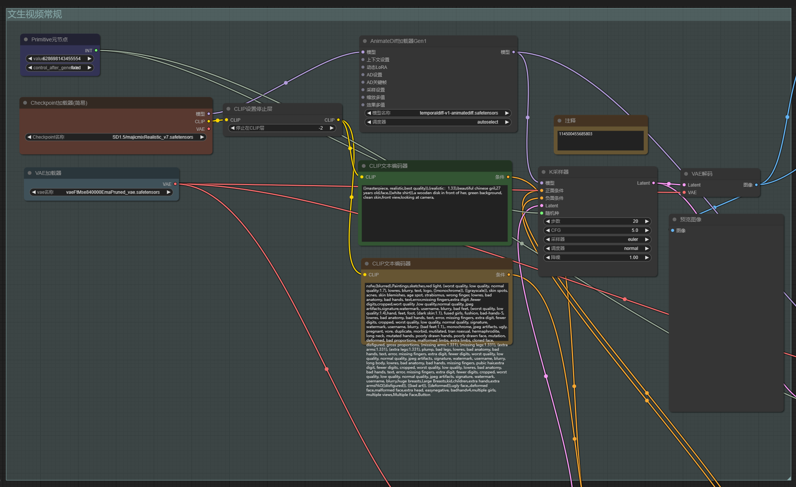
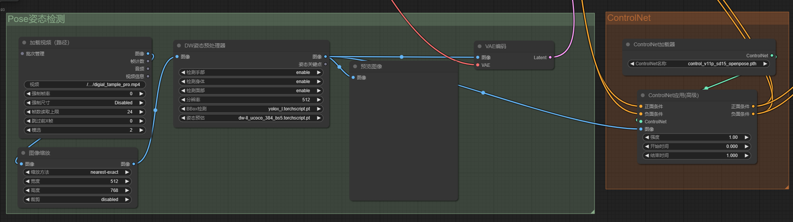
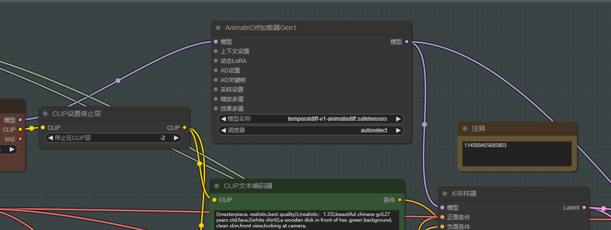
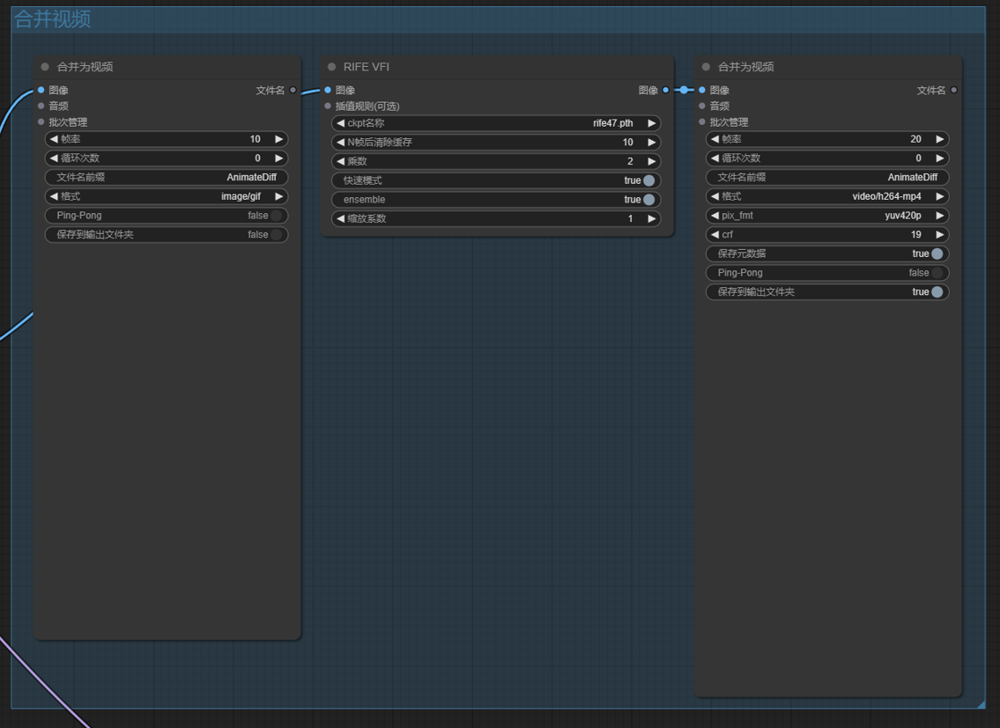
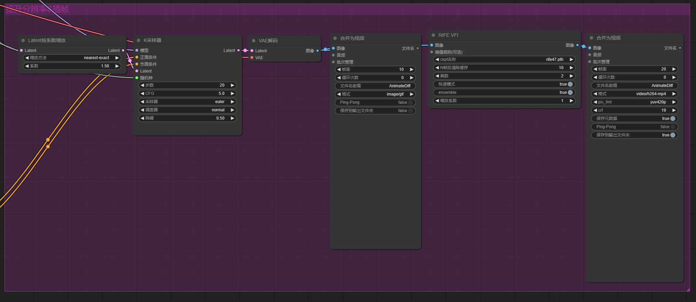

# ComfyUI Usage Documentation

## Workflow

If you already have a ComfyUI environment, you can directly use my workflow:

<p align="center">
  
</p>

## Functionalities

My Workflow has the following functionalities:

- Generate portrait images
- DW Pose generates skeleton diagrams
- ControlNet controls character pose
- AnimateDiff generates videos
- Frame interpolation to increase frame rate
- Resolution enhancement

## Environment Setup

```bash
git clone [https://github.com/comfyanonymous/ComfyUI.git](https://github.com/comfyanonymous/ComfyUI.git)
pip install -r requirements.txt
```

Test installation

```bash
cd ComfyUI
python main.py
```

## Model Download

Execute the script `python download_models.py` to download all the weights required for this project.

## Plugin Installation

1. First, you need to manually pull the [Plugin Manager]:

```bash
cd ComfyUI/custom_nodes
git clone [https://github.com/ltdrdata/ComfyUI-Manager.git](https://github.com/ltdrdata/ComfyUI-Manager.git)
```

2. Restart ComfyUI

3. Refresh the page, click on the [Manager] in the bottom right corner -> [Install Missing Nodes].

The following are the plugins I used:

| Plugin Name                     | Purpose                       |
| :------------------------------ | :---------------------------- |
| AIGODLIKE-COMFYUI-TRANSLATION   | Chinese Translation           |
| ComfyUI-Advanced-ControlNet     | Upgraded version of ControlNet Toolkit |
| ComfyUI-AnimateDiff-Evolved     | AnimateDiff animation generation |
| ComfyUI-Crystools               | Machine resource monitoring    |
| ComfyUI-Custom-Scripts          | Model Management              |
| ComfyUI-Frame-Interpolation     | Frame Interpolation           |
| ComfyUI-Impact-Pack             |                               |
| ComfyUI-Manager                 | Plugin Manager (Required)     |
| ComfyUI-VideoHelperSuite        | Video Loader                  |
| ComfyUI_FizzNodes               |                               |
| ComfyUI_IPAdapter_plus          | IPAdapter Style Transfer      |
| comfyui-portrait-master-zh-cn   | Chinese Prompt Assistant Tool for Character Generation |
| comfyui-workspace-manager       | Workflow Manager              |
| comfyui_controlnet_aux          | ControlNet Toolkit           |
| comfyui_segment_anything        | SAM Toolkit                    |
| sdxl_prompt_styler              | SDXL Toolkit                 |

## Workflow Detailed Explanation

### 1. Generate Portrait Images

<p align="center">
  
</p>

First, let's talk about the basic text-to-image process. First, add the SD checkpoint and VAE model. VAE is optional, but SD is mandatory. If you don't like my model, you can go to C站 (Civitai) to find models fine-tuned by experts.

Fill in the positive and negative prompts, and connect a KSampler to generate portraits.

### 2. DW Pose Generates Skeleton Diagrams & ControlNet Controls Character Pose

<p align="center">
  
</p>

Once the character is generated, the next step is to generate specific actions. Sometimes it's hard to describe in language, and we need to use ControlNet combined with pose estimation to make SD generate tasks with specific actions. This is the function of the bottom left part.

### 3. AnimateDiff Generates Videos

<p align="center">
  
</p>

After these two parts are set up, you can see that the task is generated with specific actions. Next, we add actions. The algorithm used is AnimateDiff. Simply connect them in series, and it's done.

### 4. Frame Interpolation to Increase Frame Rate

<p align="center">
  
</p>

We combine the generated images into a video. The original is 8 frames. We perform frame interpolation on it to make the video smoother. This is the function of the top right part.

### 5. Resolution Enhancement

<p align="center">
  
</p>

Because the default output of SD 1.5 is 512 x 512, we also need to do a scale to increase the resolution. This is the function of the bottom right part.

## Configure Video Path

Once the mp4 is generated, we can modify the `DIGITAL_HUMAN_VIDEO_PATH` parameter in the configuration [web_configs](../../utils/web_configs.py#L78) , and this video will be used to generate lip-sync in the future.

```diff
- DIGITAL_HUMAN_VIDEO_PATH: str = r"./doc/digital_human/lelemiao_digital_human_video.mp4"
+ DIGITAL_HUMAN_VIDEO_PATH: str = r"Path to the newly generated mp4"
```

## Development Reference Websites

- Model Download Website: C站 (Civitai): https://civitai.com
- Prompt Website: https://promlib.com/
- Workflow: https://openart.ai/workflows/home
- Plugin Ranking: https://www.nodecafe.org/
